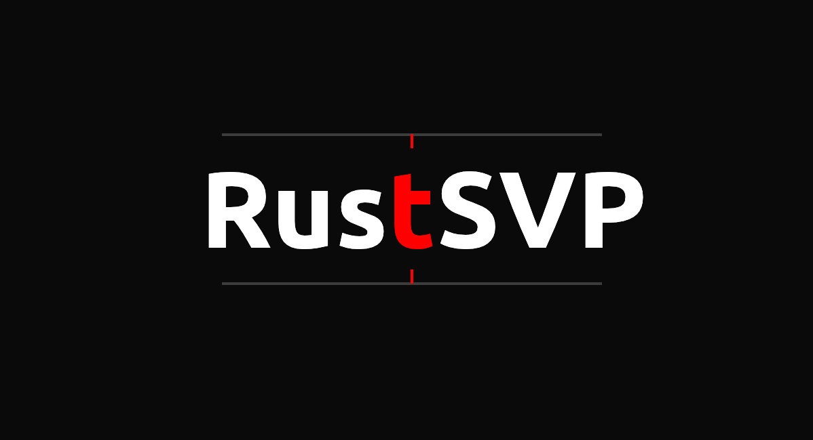
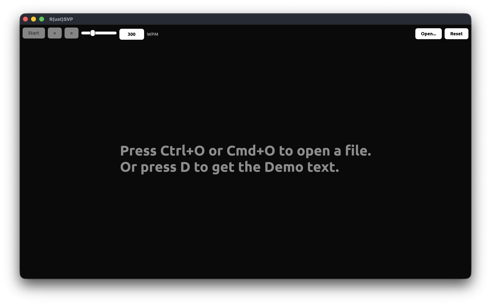
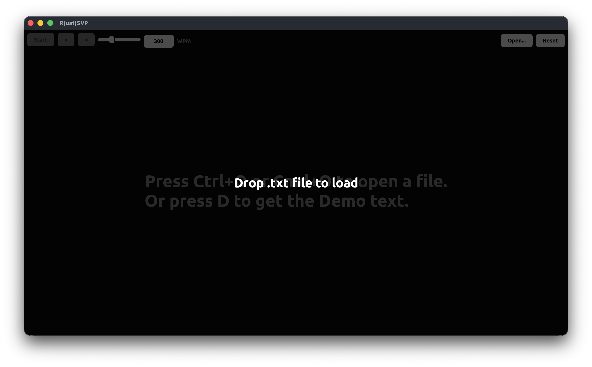
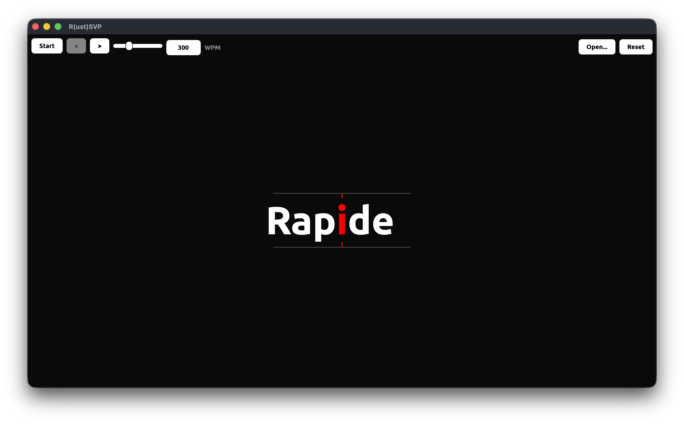

<p align="center">
    
    
    
    
    
    
    <br />
    A cross-platform <a href="https://en.wikipedia.org/wiki/Rapid_serial_visual_presentation">RSVP</a> built in Rust with <a href="https://www.egui.rs/">egui</a>
</p>

---

## Table of Contents <!-- omit from toc -->

- [What is RSVP](#what-is-rsvp)
- [Core Features](#core-features)
- [Built with...](#built-with)
- [Installation \& Quick Start](#installation--quick-start)
- [Keyboard Shortcuts](#keyboard-shortcuts)
- [Stardance Devlogs ᕙ( •̀ ᗜ •́ )ᕗ](#stardance-devlogs-ᕙ-̀-ᗜ-́-ᕗ)
- [Developement](#developement)
  - [Dependencies](#dependencies)
  - [Building R(ust)SVP from source](#building-rustsvp-from-source)
- [Boring Stuff](#boring-stuff)
  - [Use of AI](#use-of-ai)
  - [Credits](#credits)
  - [License](#license)

## What is RSVP

> Rapid serial visual representation (RSVP) is an experimental method for displaying information [...]. In RSVP, a sequence of stimuli, usually letter, digits, or words, appear at the same location on a screen or another display in short successive intervals [...].
> Because each word appears at the same fixed point, **the eyes never have to move (saccade) to find the next word**, which is where most of the time lost during normal reading comes from.

Source: [Wikipedia](https://en.wikipedia.org/wiki/Rapid_serial_visual_presentation)

---

<iframe width="560" height="315" src="https://www.youtube.com/embed/e07anny9a3Q?si=TFngLwOQ1TtP2kkJ" title="YouTube video player" frameborder="0" allow="accelerometer; autoplay; clipboard-write; encrypted-media; gyroscope; picture-in-picture; web-share" referrerpolicy="strict-origin-when-cross-origin" allowfullscreen></iframe>

<table align="center" border="0">
    <tr>
        <td colspan="4" align="center">
            <br>
            <sub><b>Home</b></sub>
        </td>
        <td colspan="4" align="center">
            <br>
            <sub><b>Drag & Drop</b></sub>
        </td>
    </tr>
    <tr>
        <td colspan="6" align="center">
            <br>
            <sub><b>Running</b></sub>
        </td>
    </tr>
</table>

## Core Features

* **Word-by-word display**: the text is split into words and shown one at the time, centered on screen
* **Optimal Recognition Point (ORP)**: each word have the center letter highlighted in red and align with the Guide bar
* **Eye guide bar**: top & bottom line with a notch to guide your eyes to the centered red letter
* **Adjustable speed**: a WPM (words per minute) slider, plus `UP` / `DOWN` keyboard shortcut, from 10 to 1000 WPM (the recommanded value is around 300 WPM)
* **Sentence Navigation**: jump to the previous or next sentence with `LEFT` / `RIGHT` on the keyboard or with the buttons
* **File loading**:
  * Open a `.txt` file via `Ctrl+O` / `Cmd+O` or the toolbar button
  * Drag & drop: drop a `.txt` file directly in the window, with a visual overlay while hovering.
  * Bult-in demo text (`D`) if you just want to try R(ust)SVP
* **No UI mode**: hide the UI with `H`, to leave only the guide line and the words on the screen
* **Theme**: dark mode with the Ubuntu Bold font

## Built with...

This project was built to learn Rust GUI development and experiment with RSVP. Here is what I used:

* [Rust](https://rust-lang.org/): for the whole app ! `ദ്ദി(˵ •̀ ᴗ - ˵ ) ✧`
* [egui](https://www.egui.rs/) / [eframe](https://docs.rs/eframe/latest/eframe/): easy GUI, native windowing and coss-platform rendering (Windows, macOS, Linux)
* [rfd](https://docs.rs/rfd/latest/rfd/): native "Open File" dialogs on every platform

## Installation & Quick Start

The easiest way to get the emulator is to install it directly via [crates.io](https://crates.io/crates/) using Cargo:

TODO: add crates link + cargo command
```bash
cargo install
```

> [!TIP]
> Press `D` on launch to load a demo RSVP text, or `Ctrl+O` / `Cmd+O` to open your own `.txt` file

## Keyboard Shortcuts

| Key                 | Action                             |
| ------------------- | ---------------------------------- |
| `Space`             | Play / Pause                       |
| `LEFT` / `RIGHT`    | Jump to previous / next sentence   |
| `UP` / `DOWN`       | Increase / decrease WPM            |
| `Ctrl+O` / `Cmd+O`  | Open a `.txt` file                 |
| `D`                 | Load the demo text                 |
| `R`                 | Reset to the beginning of the text |
| `H`                 | Toggle the UI                      |

## Stardance Devlogs ᕙ( •̀ ᗜ •́ )ᕗ

On [Stardance](https://stardance.hackclub.com/) you can watch the full development process via all the devlogs I've created here: [R(ust)SVP Devlogs](hhttps://stardance.hackclub.com/projects/50860)

## Developement

> [!IMPORTANT]
> You must have [Rust](https://rust-lang.org/) and [Cargo](https://doc.rust-lang.org/cargo/) installed on your computer

### Dependencies

* [egui](https://www.egui.rs/) / [eframe](https://docs.rs/eframe/latest/eframe/)
* [rfd](https://docs.rs/rfd/latest/rfd/)
* [`std` modules](https://doc.rust-lang.org/std/)

### Building R(ust)SVP from source

* Clone the repository with

```bash
git clone https://github.com/wirenux/RustSVP.git
cd RustSVP
```

* Then install the dependencies and run the program with:

```bash
cargo run
```

## Boring Stuff

### Use of AI

* Debugging `egui`/`eframe` API changes across versions, and brainstorming

### Credits

This project is created by [@wirenux](https://github.com/wirenux) in [Rust](https://rust-lang.org/) and use [egui](https://www.egui.rs/)

### License

This project is released under the [MIT License](./LICENSE)